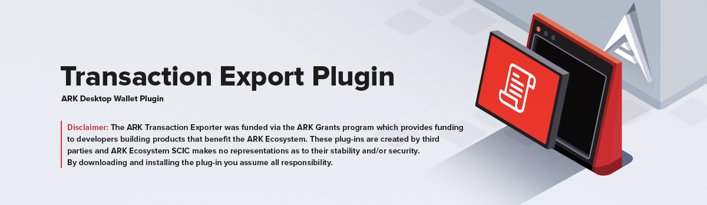

# Transaction Export Plugin

> Export your wallet transaction history. The information presented by this plugin has been prepared for informational purposes only, and is not intended to provide, and should not be relied on for, tax, legal or accounting advice.

## Installation

Install this plugin directly through the Plugins Manager of the Desktop Wallet. Alternatively you can clone or [download](https://github.com/dated/transaction-export-plugin/archive/master.zip) this repository and unzip it into `~/.ark-desktop/plugins/`.

## Credits

- [Edgar Goetzendorff](https://github.com/dated)
- [All Contributors](../../contributors)

## License

[MIT](LICENSE) © [Edgar Goetzendorff](https://github.com/dated)
